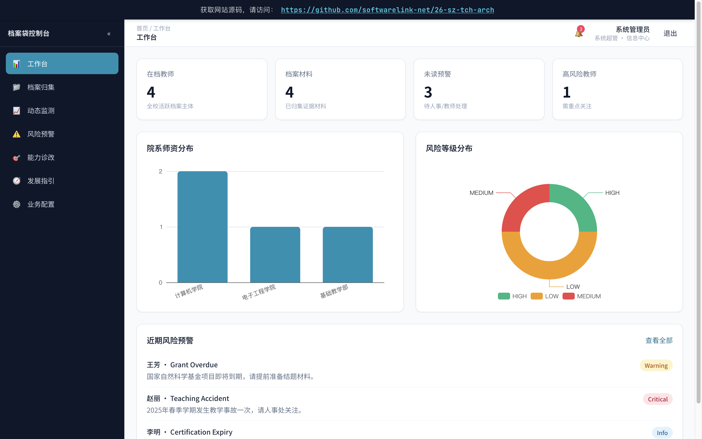

# 苏州职业技术大学教师成长档案袋系统

**上线主域名**：https://26-sz-tch-arch.softwarelink.net/

**项目仓库**：https://github.com/softwarelink-net/26-sz-tch-arch



## 项目简介

本项目为苏州职业技术大学定制的“教师全生命周期成长档案系统”。系统以教师职业全周期教学档案数据为核心底座，打通校内人事、教务、科研、学工等多业务系统数据，构建统一标准、分级管控、全程可溯的教师档案数据体系。面向人事管理部门、教师个人、双高建设管理部门三类核心用户，打造覆盖档案归集治理、师资动态监测、风险智能预警、业务灵活配置、能力评价诊改、教师发展指引的一体化数字化应用。

## 部署与运行说明

### 环境要求
- Node.js >= 18.0.0
- npm >= 9.0.0

### 依赖安装
```bash
npm install
```

### 本地运行
本项目为纯前端静态应用，无需后端服务即可直接运行演示。
```bash
npm run dev
```
启动后访问 `http://localhost:5173` 查看效果。

### 演示账号密码表

| 角色 | 用户名 | 密码 | 说明 |
| :--- | :--- | :--- | :--- |
| 超管 (Admin) | admin | admin123 | 拥有所有系统配置权限 |
| 人事主管 (HR) | hr_manager | hr123 | 可查看本部门教师数据与预警 |
| 教师 (Teacher) | teacher01 | tch123 | 仅查看个人档案与发展指引 |
| 决策层 (Leader) | decider | dec123 | 仅查看全局统计与双高建设大屏 |

### 常用 npm 脚本
- `npm run dev`: 启动本地开发服务器
- `npm run build`: 生产环境打包
- `npm run preview`: 预览生产构建结果
- `npm run lint`: 代码规范检查
- `npm run db:seed`: 根据 `src/db/schema.sql` 生成 `public/db.sqlite`

### 项目目录结构
```
26-sz-tch-arch/
├── docs/                  # 文档与素材
├── public/                # 静态资源
│   └── favicon.ico
├── src/
│   ├── api/               # 模拟 API 接口定义 (Mock)
│   ├── assets/            # 图片、图标资源
│   ├── components/        # 公共组件
│   ├── layouts/           # 布局组件 (AuthLayout, MainLayout)
│   ├── router/            # 路由配置
│   ├── stores/            # Pinia 状态管理
│   ├── views/             # 页面视图
│   ├── App.vue            # 根组件
│   ├── main.ts            # 入口文件
│   └── style.css          # 全局样式 (Tailwind 指令)
├── .gitignore
├── index.html
├── package.json
├── tsconfig.json
└── vite.config.ts
```

## 招标公告全文

- **标题**：苏州职业技术大学教师成长档案袋系统采购公告
- **项目发包方**：苏州职业技术大学
- **项目编号**：JSZC-320500-JZCG-C2026-0220
- **项目发布时间**：2026-09-03
- **关键词**：教师档案, 智慧校园, 人事管理, 双高建设, 数据治理, 绩效评价

**摘要**

拟建系统以教师职业全周期教学档案数据为核心底座，通过打通校内人事、教务、科研、学工、师资培训等多业务系统数据，构建统一标准、分级管控、全程可溯的教师档案数据体系；面向人事管理部门、教师个人、双高建设管理部门三类核心用户，打造覆盖档案归集治理、师资动态监测、风险智能预警、业务灵活配置、能力评价诊改、教师发展指引的一体化数字化应用。

**技术要点**

多源数据集成、分级权限管控、数据可视化大屏、风险智能预警算法。

**技术创新性**

引入教师全生命周期数字画像，实现从“静态档案管理”向“动态发展指引”的转变；支持“双高”建设指标的实时监测与诊断。

## 免责声明

1. **数据来源与合规性**：本项目所涉数据信息均采集自互联网公开渠道发布的标讯公示信息。项目开发者严格遵守《中华人民共和国数据安全法》及相关法律法规，确保数据来源合法、公开、可查询。
2. **技术实现路径**：本项目核心内容系基于国产大语言模型进行算法推演与自动化构造生成，非直接引用或复制原始招标文件。
3. **保密承诺**：本项目郑重承诺：不涉及、不包含任何国家秘密、商业秘密或未公开的敏感信息。所有生成内容均基于公开数据的逻辑推演。
4. **知识产权与巧合声明**：鉴于本项目内容均由AI模型基于公开数据推演生成，若生成内容在表述方式、结构逻辑上与任何第三方原始标书文件存在相似之处，纯属技术通用设计之巧合，不构成对任何第三方著作权的侵犯或商业秘密的泄露。本项目不保证生成内容的准确性与完整性，仅供技术研究与学习参考。
5. **免责条款**：任何单位或个人使用本项目代码及生成内容所产生的一切后果，均由使用者自行承担，项目开发者不承担任何法律责任。
